 

    <h1>
        영화 흥행요소 분석 포트폴리오 - 수정중
    </h1>

 

    

  

# ✏목차

1. [주제선정](https://github.com/suyeee/DE_Project#%EC%A3%BC%EC%A0%9C-%EC%84%A0%EC%A0%95)

2. [프로젝트 기간](https://github.com/suyeee/DE_Project#%ED%94%84%EB%A1%9C%EC%A0%9D%ED%8A%B8-%EA%B8%B0%EA%B0%84)

3. [역할분담](https://github.com/suyeee/DE_Project#%EC%97%AD%ED%95%A0%EB%B6%84%EB%8B%B4)

4. [기술 스택](https://github.com/suyeee/DE_Project#%EA%B8%B0%EC%88%A0-%EC%8A%A4%ED%83%9D)

5. [전체 아키텍쳐](https://github.com/suyeee/DE_Project#%EC%A0%84%EC%B2%B4-%EC%95%84%ED%82%A4%ED%83%9D%EC%B3%90)

   + [ERD]

6. [협업 관리](https://github.com/suyeee/DE_Project#%ED%98%91%EC%97%85%EA%B4%80%EB%A6%AC)

7. [데이터 수집 과정]

   ​	i. [네이버 영화 크롤링]

   ​	ii. [인스타그램 크롤링]

   ​	iii. [영화진흥위원회 OpenAPI]

8. [데이터 분석결과](https://github.com/suyeee/DE_Project#%EB%8D%B0%EC%9D%B4%ED%84%B0-%EB%B6%84%EC%84%9D-%EA%B2%B0%EA%B3%BC)

   ​	i. [한국 영화시장](https://github.com/suyeee/DE_Project#%ED%95%9C%EA%B5%AD-%EC%98%81%ED%99%94%EC%8B%9C%EC%9E%A5)

   ​	ii. [코로나 기간의 영화시장](https://github.com/suyeee/DE_Project#%EC%BD%94%EB%A1%9C%EB%82%98-%EA%B8%B0%EA%B0%84%EC%9D%98-%EC%98%81%ED%99%94%EC%8B%9C%EC%9E%A5)

   ​	iii. [흥행요인 : 영화시장의 활성화](https://github.com/suyeee/DE_Project#%ED%9D%A5%ED%96%89%EC%9A%94%EC%9D%B8-%EC%98%81%ED%99%94-%EC%8B%9C%EC%9E%A5%EC%9D%98-%ED%99%9C%EC%84%B1%ED%99%94)

   ​	iv. [흥행요인 : 러닝타임과 상영기간](https://github.com/suyeee/DE_Project#%ED%9D%A5%ED%96%89%EC%9A%94%EC%9D%B8--%EB%9F%AC%EB%8B%9D%ED%83%80%EC%9E%84%EA%B3%BC-%EC%83%81%EC%98%81%EA%B8%B0%EA%B0%84)

   ​	v. [흥행요인 : 출연배우의 영향력](https://github.com/suyeee/DE_Project#%ED%9D%A5%ED%96%89%EC%9A%94%EC%9D%B8--%EC%B6%9C%EC%97%B0%EB%B0%B0%EC%9A%B0%EC%9D%98-%EC%98%81%ED%96%A5%EB%A0%A5)

9. [한계점 및 아쉬운점](https://github.com/suyeee/DE_Project#%ED%95%9C%EA%B3%84%EC%A0%90-%EB%B0%8F-%EC%95%84%EC%89%AC%EC%9A%B4%EC%A0%90)

   

# 💡**주제 선정**

코로나 이후 첫 천만관객 영화인 범죄도시2를 보며 영화를 흥행하게 만드는 흥행요소는 어떤것일지 알아보고자 분석을 진행하였다.

   

# 🗓프로젝트 기간

**22.05.25 ~ 22.06.20 (15days)**

- 주제 선정 및 기획 설계 : 22.05.25 ~ 22.05.28
- ProDS 특강 : 22.05.30 ~ 22.05.31
- 알고리즘 특강 : 22.06.09 ~ 22.06.10
- 프로젝트 구현 : 22.06.01 ~ 22.06.16
- 산출물 및 발표자료 정리 : 22.06.16 ~ 22.06.19
- 프로젝트 발표 : 22.06.20

   

# 🔧역할분담

 

    <table>
        <tr>
            <td height="140px" align="center">
            	 
                  김흥민 👑조장
            </td>
        	<td height="140px" align="center">
            	
                  박상권 팀원			
            </td>
        	<td height="140px" align="center">
            	 
                  최진호 팀원	
            </td>
        	<td height="140px" align="center"><a href="https://github.com/suyeee">
            	 
                  황수연 팀원</a>
            </td>
        </tr>
        <tr>
            

                <td bgcolor = '#f5f5f5'>
                    <ul>
                        <li>네이버영화 사이트 크롤링</li>
                        <li>네이버 영화 데이터 전처리</li>
                        <li>MySQL 파이프라인 구축</li>
                        <li>통합 데이터 분석 및 시각화</li>
                        <li>발표자료 편집</li>
                    </ul>
                </td>
                <td bgcolor = '#f5f5f5'>
                    <ul>
                        <li>네이버영화 사이트 크롤링</li>
                        <li>네이버 영화 데이터 전처리</li>
                        <li>MySQL 파이프라인 구축</li>
                        <li>통합 데이터 분석 및 시각화</li>
                        <li>발표자료 편집</li>
                    </ul>
                </td>
                <td bgcolor = '#f5f5f5'>
                    <ul>
                        <li>인스타그램 크롤링</li>
                        <li>영화진흥위 데이터 수집</li>
                        <li>영화진흥위 데이터 전처리</li>
                        <li>통합 데이터 분석 및 시각화</li>
                        <li>발표자료 편집</li>
                    </ul>
                </td>
                <td bgcolor = '#f5f5f5'>
                    <ul>
                        <li>인스타그램 크롤링</li>
                	    <li>영화진흥위 데이터 수집</li>
                	    <li>인스타그램 데이터 전처리</li>
                	    <li>인스타그램 데이터 시각화</li>
                	    <li>통합 데이터 분석 및 시각화</li>
                	    <li>발표자료 초안 작성</li>
                    </ul>
                </td>
            

        </tr>
    </table>

     

# 💻기술 스택

       

    

     

# 🗂전체 아키텍쳐

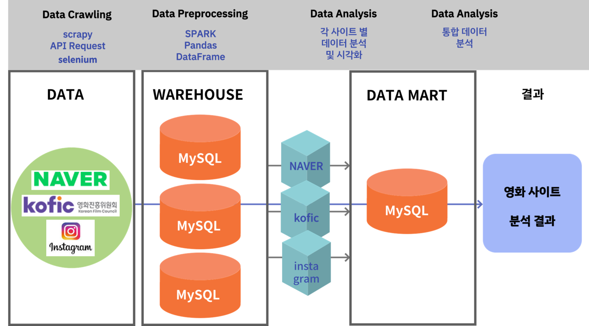

   

## ERD

 

     

# 📋협업관리

> **슬랙, 노션, 줌으로 진행상황 공유**

 

**노션**

  

# 🧲데이터 수집 과정 -수정중

> **네이버 영화 크롤링 과정**
>
> **인스타그램 크롤링 과정**
>
> **영화진흥위원회 OpenAPI 수집 과정**

   

## 네이버 영화 크롤링 과정

1. 영화 코드번호 수집

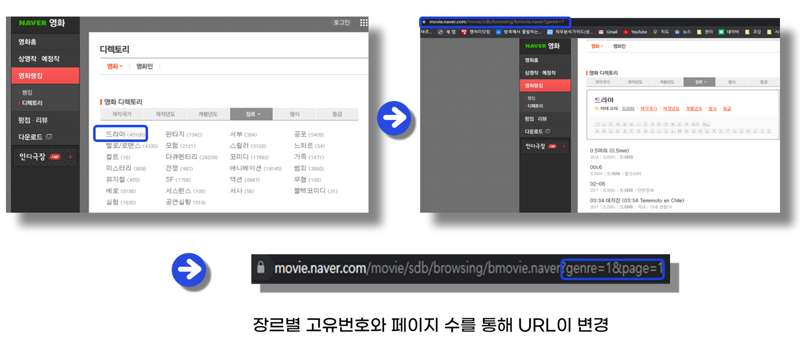

    

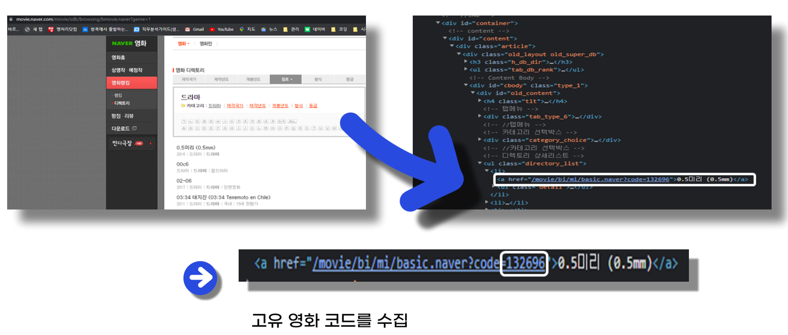

    

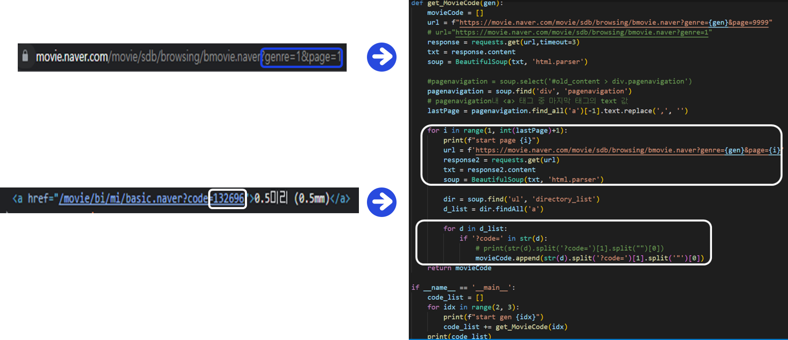

+ 위 과정을 반복하는 코드를 작성

    

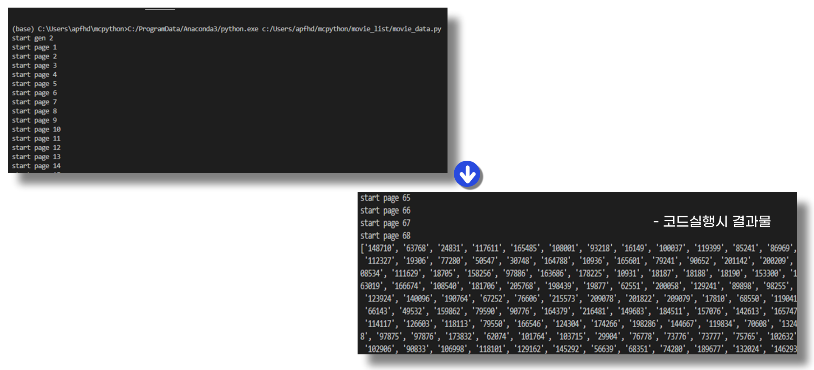

    

2. 영화별 세부데이터 수집

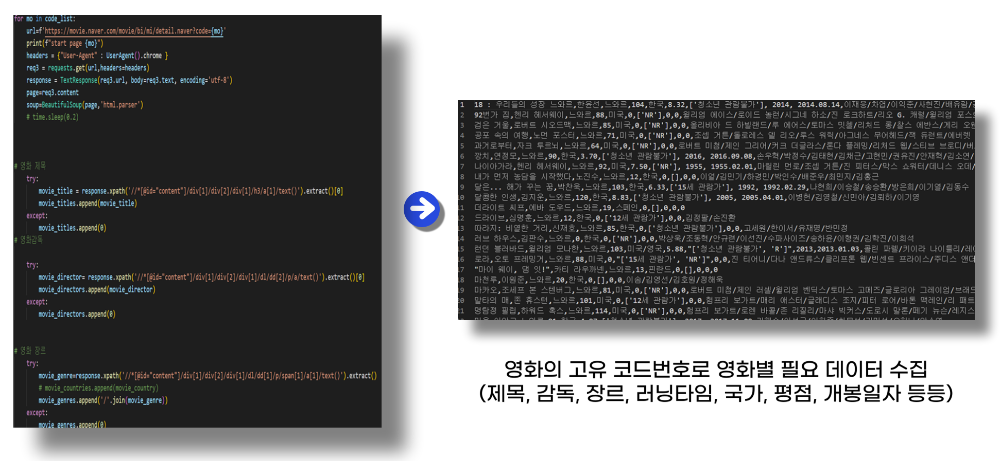

     

## 인스타그램 크롤링 과정

 

    

    

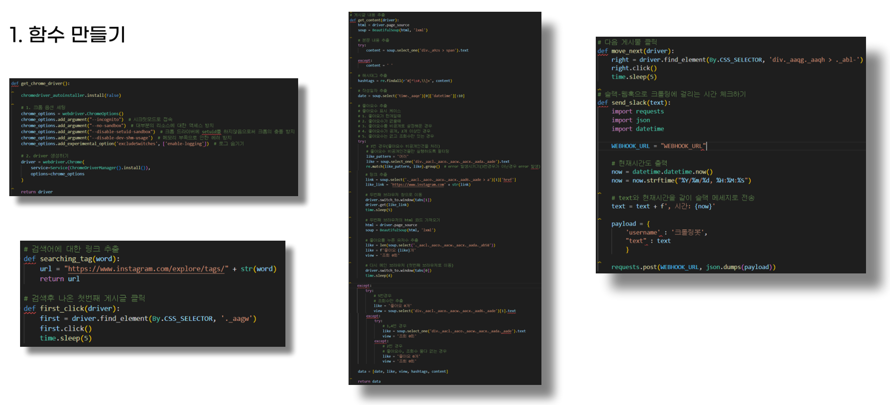

 

+ 함수 6개를 만든다.
  + 인스타그램을 크롤링하기위해 크롬에 대한 옵션세팅과 드라이버를 생성하는 함수
  + 검색어에 대한 링크를 호출해주는 함수
  + 검색후 나온 첫번째 게시글을 클릭해주는 함수
  + 게시글의 내용을 추출해주는 함수
  + 다음 게시글을 클릭해주는 함수
  + 크롤링하는데 걸리는 시간 측정을 위해 슬랙으로 진행상황과 시간을 같이 보내주는 함수

    

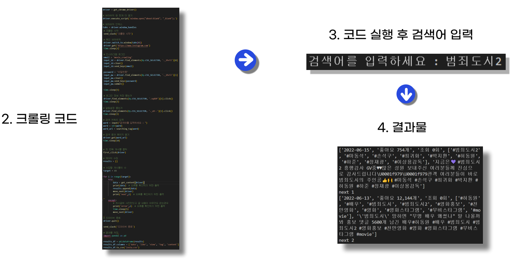

 

+ 드라이버를 실행시키면 슬랙으로 '크롤링 시작' 메시지와 함께 현재날짜와 시간이 같이 전송됨.
+ 드라이버 실행후엔 인스타그램 로그인을 하고 검색어를 입력하게 해주는 input 함수가 실행됨. 검색할 검색어를 터미널에 입력을 해주게 되면 사전에 만들어둔 함수로 인해 해당 검색어에 대한 링크가 호출된다.
+ 검색어에 대한 링크로 페이지가 이동되면 해당 페이지의 첫번째 게시글을 클릭을 한 후 게시글 내용을 추출해주는 함수로 인해 게시글 내용이 추출된다.
  + 게시글 내용 : 좋아요수, 조회수, 해시태그, 해시태그를 포함한 전체 게시글 내용
+ 첫번째 게시글에 대한 추출이 끝나면 다음페이지로 이동하는 버튼을 클릭하여 이동하는데 이동하고 나서부턴 for 문에 의해 원하는 게시글의 갯수에 맞게 for문이 실행된다.
+ 게시글 수집이 전부 완료되면 자동으로 드라이버가 종료되고 '드라이버 종료' 메세지와 함께 현재날짜와 시간이 같이 출력. 그 후에는크롤링한 결과물을 csv로 저장하거나 MySQL 데이터베이스에 저장하는데 저장이 완료되면 마찬가지로 슬랙에 '결과 저장' 메시지와 날짜, 시간이 같이 전송된다.

    

    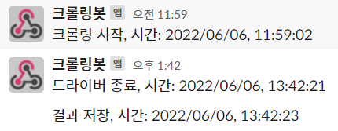  
    

        <
        slack으로 온 메세지 (진행상황, 날짜, 시간)>
    

     

### 인스타그램 크롤링 과정 영상

 

- Selenium 활용
- 좋아요수와 조회수, 해시태그, 게시글 내용 추출
- 좋아요수가 비공개인 경우 좋아요를 누른 유저수를 추출

    

## 영화진흥위원회 OpenAPI

1. 데이터 수집 요청

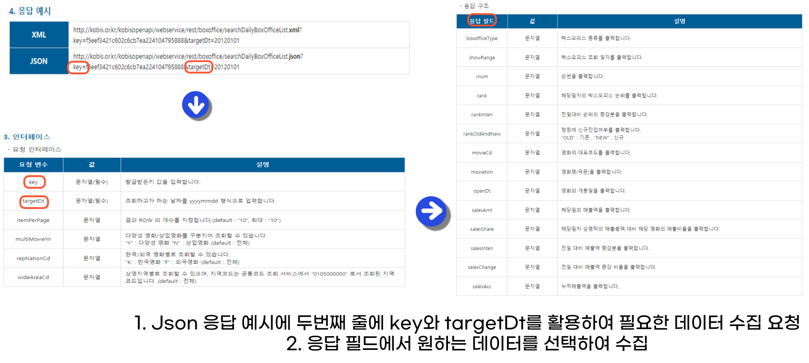

     

2. 영화별 세부데이터 수집

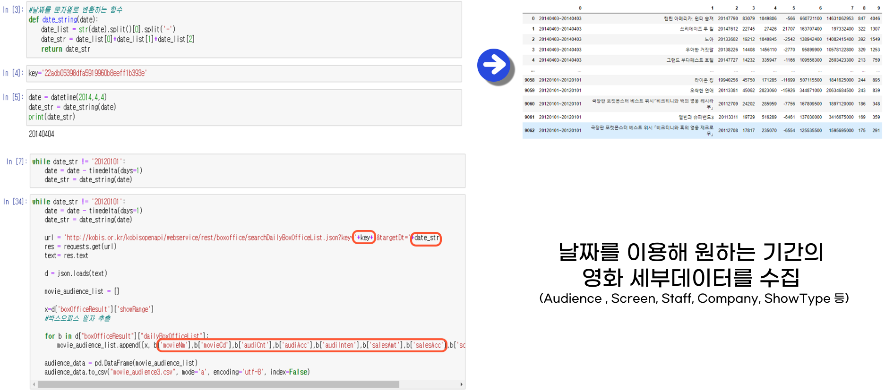

      

# 📊데이터 분석 결과

> 내 파트부분만 정리

 

## 한국 영화시장

 

    

  

- 최근 10년간의 한국영화만 본것
- 최근 10년간 영화관에서 상영한 영화의 갯수는 693개 이며, 이 영화들중 500만 이상의 영화는 49개, 700만 이상은 31개, 천만영화의 경우 14개
- 전체 영화중 소수의 영화들만 흥행한다.

  

## 코로나 기간의 영화시장

 

    

 

- 코로나 기간동안 (2020.04~2022.03) 개봉한 영화들의 흥행 실적
- 코로나 발생기간동안에는 500만 이상으로 흥행한 영화는 없는것으로 나왔다.
- 코로나 기간에는 대부분의 영화가 흥행에 실패한것으로 보인다.

  

## 흥행요인: 영화 시장의 활성화

> **여러 흥행요인들중 영화시장의 활성화에 따라 흥행에 영향을 미치는지를 분석**

 

    
      
    

 

- 흥행한 영화들의 기준을 누적 관객수 500만 이상으로 잡고 분석한 결과 흥행영화들의 개봉시기는 7,8,12월에 집중되어 있었으며, 흥행이 저조한 영화 (누적관객수 100만 미만)의 경우 11월을 가장 많이 선택했고 8월은 가장 적게 선택한 모습을 볼수있다.

   

    

 

- 누적관객수 500만 이상의 영화들은 11월을 가장 적게 선택하는데에 반해 100만 미만의 영화들은 11월을 가장 많이 선택했다.
- 누적관객수 300만 이상의 영화들은 8월을 많이 선택했는데 100만 미만의 영화는 8월을 가장 적게 선택했다.

 <u>결론: 영화의 흥행에 자신있다면 7,8,12월을 선택하고, 흥행에 자신이 없다면 4,11월을 선택하는게 좋다.</u>

  

## 흥행요인 : 러닝타임과 상영기간

> **러닝타임과 상영시간이 영화의 흥행에 영향을 미치는지를 분석**

 

    

 

- 영화의 평균 러닝타임은 약 109분 정도이다.
- 표준편차는 17.05 정도이다.

  

    

 

- 대체로 상영시간과 누적관객수는 비례하는 형태를 띄고있다는것을 확인할수있다.
- 누적관객수를 100만 미만으로 보유하고있는 영화의 평균상영시간이 제일 적다는것을 알수있다.

  

    <table border='1'>
        <thead>
            <tr>
                <th>audience</th>
                <th>time</th>
            </tr>
        </thead>
        <tbody>
            <tr>
                <td>전체 평균</td>
                <td>108.09</td>
            </tr>
            <tr>
                <td>100만 미만</td>
                <td>102.91</td>
            </tr>
            <tr>
                <td>100~300만</td>
                <td>116.12</td>
            </tr>
            <tr>
                <td>300~500만</td>
                <td>121.21</td>
            </tr>
            <tr>
                <td>500~700만</td>
                <td>120.17</td>
            </tr>
            <tr>
                <td>700만 이상</td>
                <td>127.13</td>
            </tr>
        </tbody>
    </table> 
    

        <표 : 누적 관객수에 따른 영화의 평균 러닝타임(DataFrame)>
    

   

    

 

- 전체 컬럼들의 상관관계를 보면 위와 같다.
- 일일 관객수와 일일 매출액의 상관계수가 가장 크다.

  

    

 

- 러닝타임과 누적관객수의 상관계수가 0.41로 나왔다.
- 뚜렷한 양적 상관관계를 가진다.
- 즉, 상영시간이 평균러닝타임 이상일경우 러닝타임이 길수록 관객들이 선호한다는 얘기가 된다.
    - 보통의 퀄리티 높은 영화들은 보여줄 내용이 많기에 러닝타임이 길것이므로 결국은 내용이나 퀄리티가 좋아야 흥행한다고 생각한다.
    - 그렇지만 무조건 러닝타임이 길다고해서 모든 영화가 흥행하는것은 아니다.
    

  

    

 

- 누적관객수 100만 미만은 대체로 상영기간이 짧다
- 누적관객수 500만 이상의 영화들은 우상향하는 형태를 보인다.

 

<u>결론 : 러닝타임은 평균 이상으로 하는게 좋고 영화가 흥행을 하고있다면 상영기간을 늘리자.</u>

  

## 흥행요인 : 출연배우의 영향력

> **출연배우의 영향력을 알아보기 위해 최근개봉 영화들중 1000만 관객수를 돌파한 범죄도시2를 키워드로 인스타그램을 크롤링한것**

 

- 인스타그램 크롤링 데이터를 이용해 해시태그를 워드 클라우드로 나타낸 결과 영화에 출연한 배우들이 같이 태그되어있는걸 볼수있다.

 

<u>결론 : 영화의 흥행에 도움이 될만한 배우를 캐스팅하자</u>

  

# ⏳한계점 및 아쉬운점

- 프로젝트 일정중에 특강이나 휴강일들이 많아서 실제로 프로젝트를 진행한 기간은 15일 정도인데 기간이 너무 짧아 다양한 분석을 시도해보지 못한게 아쉬웠고
- 영화진흥위에서 스텝에 관한 데이터를 수집해오기 위해 코드를 짜뒀는데 6월 15일 이후부터 수집이 막혀서 스텝 데이터를 분석에 활용하지 못한게 아쉬웠다.
- Spark나 Airflow를 많이 활용하지 못한점도 아쉽다.
- 인스타그램 데이터를 출연배우가 영향력을 미치는지에 관한 워드클라우드로만 활용한점이 아쉽긴했다. 인스타그램에서 락을 걸어둔건지 1000개 이상부터는 크롤링 진행이 안되서 1000개만 크롤링하는걸로 만족해야했다.
- Django를 이용해 웹브라우저를 구현한뒤 브라우저에서 검색어를 입력하면 해당 내용에 관한 인스타 크롤링을 진행하고 그 결과에 대한 워드 클라우드를 보여준다던지 머신러닝을 이용해 최근에 개봉한 영화들이 흥행에 성공할지를 예측하는 모델을 만들어보고싶었는데 프로젝트 기간내에 하기는 힘들어서 포기했는데 아쉽다.
- 카카오톡 챗봇으로 영화의 실시간 예매율이나 좌석점유율 등을 알려주는 서비스를 구현하는것도 해봤으면 좋았을거같다.

  

-------------------------------------------------

